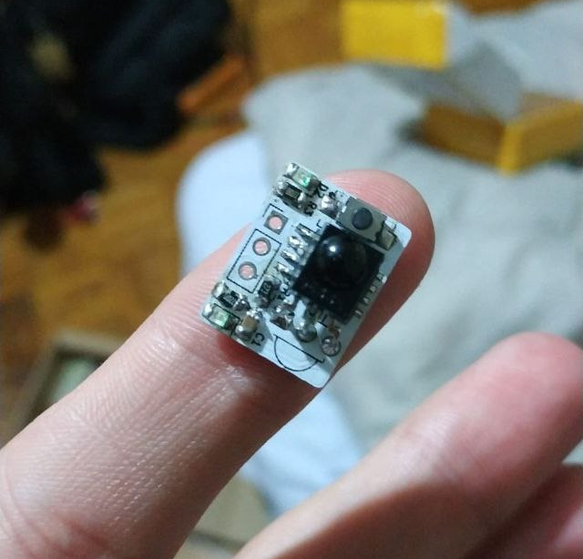
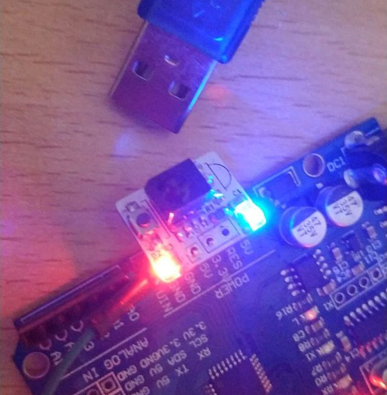

# IRStart

Modulo prototipo de arranque IR de robots usando Attiny85

## Hardware
- ATTiny85 SMD SOIC-8
- Moudulo IR TSOP4838
- Led Verde smd 0804
- Led Rojo smd 0804
- 2 Resistencias 220 ohm  smd 0804
- 1 Resistencia 47k smd 0804
- 1 Botón smd 1206

## Software
- Programado con Arduino IDE
- Disponible programa para Arduino UNO/Nano y ATTiny85

