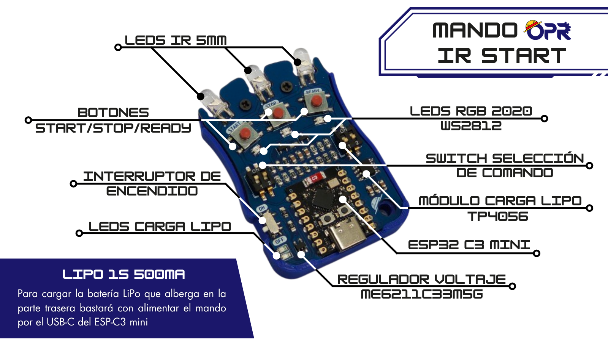
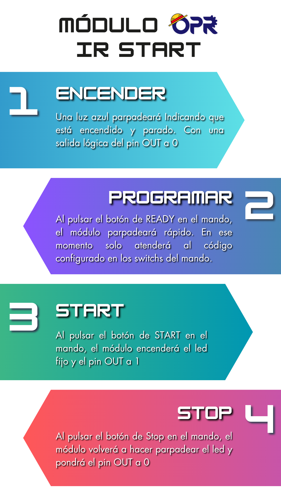

# IRStart

Mando y módulo para el arranque de nuestros robots usando el protocolo RC5.
Basado en: https://p1r.se/startmodule/ por lo que lo hemos hecho compatible
y con un funcionamiento muy similar para que sea apto para competir en la
RoboChallenge de Rumania.

## ⚙️ Hardware

### Módulo
- ATTiny13 SMD SOIC-8
- Receptor IR TSOP4838
- LED azul SMD 0804
- 1 resistencia 220 Ω SMD 0804
- 1 condensador 104 (100 nF) SMD 0402

### Mando
- ESP32 C3 Super Mini
- 3 LEDs IR con MOSFETs (Start/Stop alta intensidad, Ready baja intensidad)
- DIP switch ×4 para configuración de robot (ID)
- NeoPixel RGB ×3 para indicación de estado
- Botones: Start, Stop, Ready, Mode
- Interruptor de encendido
- Módulo de carga de batería LiPo
- Batería LiPo 1S 500 mAh

## 💻 Software

- Programado con PlatformIO (Arduino framework)
- Firmware para módulo (ATtiny13/ATtiny85) y mando (ESP32-C3)
- **Protocolos IR**: RC5, NEC, SIRC
- **Modos**: IRSTART (competición) + IRMENU (control de menú remoto)
- **Frecuencia portadora**: 36 kHz (RC5) / 37 kHz (NEC, SIRC)
- **Debug**: Serial 115200 baud + patrones LED

## 📚 Documentación

- [Hardware](docs/01-hardware.md) — MCUs, pinout, componentes, diseño 3D
- [Arquitectura Software](docs/02-software-architecture.md) — Bucles, ISRs, máquinas de estado
- [Protocolos IR](docs/03-ir-protocols.md) — RC5, NEC, SIRC: codificación y timing
- [Menú](docs/04-menu-system.md) — Modo IRMENU y navegación remota
- [Debug](docs/05-debug-system.md) — Salida serie y patrones LED
- [EEPROM](docs/06-storage.md) — EEPROM del ATtiny
- [Problemas Conocidos](docs/07-known-issues.md) — 10 issues (3 críticos)

## 🔧 Stack Tecnológico

| Componente | Tecnología |
|-----------|-----------|
| **Mando MCU** | ESP32-C3 (RISC-V 160 MHz) |
| **Módulo MCU** | ATtiny13/85 (AVR 8-bit) |
| **Framework** | Arduino |
| **Entorno** | PlatformIO |
| **Lenguaje** | C++11 |
| **Protocolos** | RC5, NEC, SIRC |
