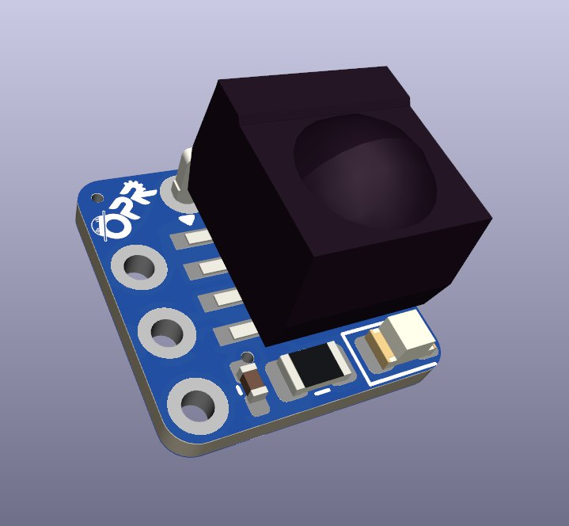
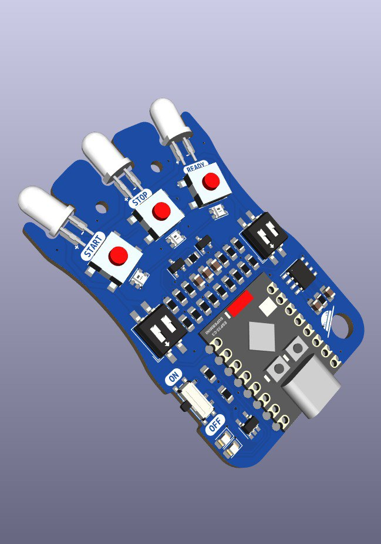

# IRStart
Mando y modulo para el arranque de nuestros robots usando el protocolo RC05 esta basado en: https://p1r.se/startmodule/ por lo que lo hemos hecho compatible y con un funcionamiento muy similar para que sea apto para competir en la robochallenge de rumania.

## Hardware modulo
- ATTiny13 SMD SOIC-8
- Moudulo IR TSOP4838
- Led Azul smd 0804
- 1 Resistencias 220 ohm  smd 0804
- 1 Resistencia 47k smd 0804
- 1 Condesador 104 smd 0402
## Hardware mando
- ESP32 C3 super mini
- 3 leds IR
- 2 switch x2 smd
- 1 interruptor de encendido
- 2 mosfets para alta y baja intensidad de los leds
- 1 modulo de carga de bateria
- 1 bateria Lipo 1s 500mah

## Software
- Programado con Arduino IDE
- Disponible programa para modulo y mando

