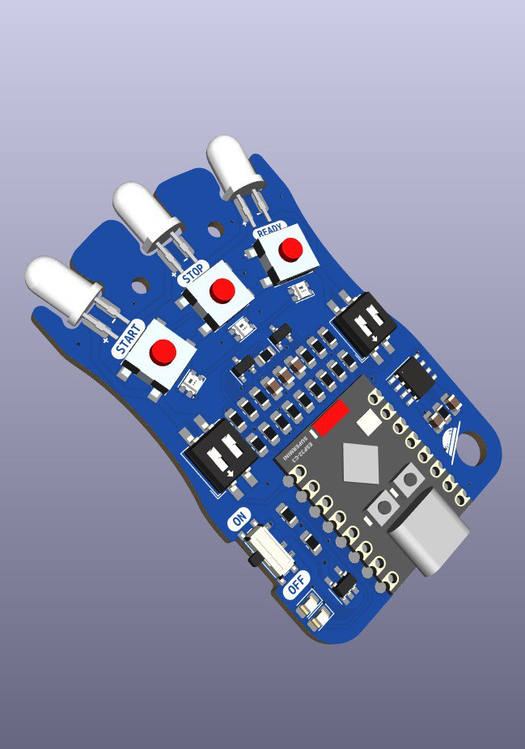
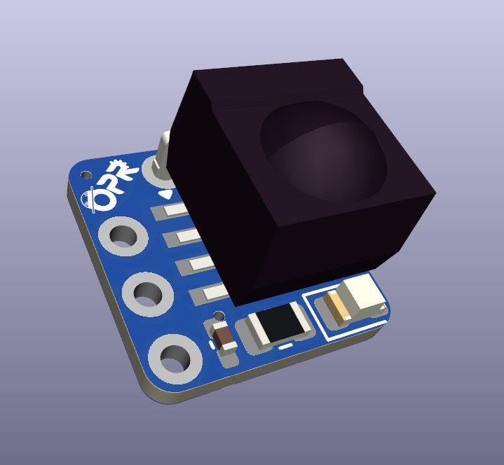
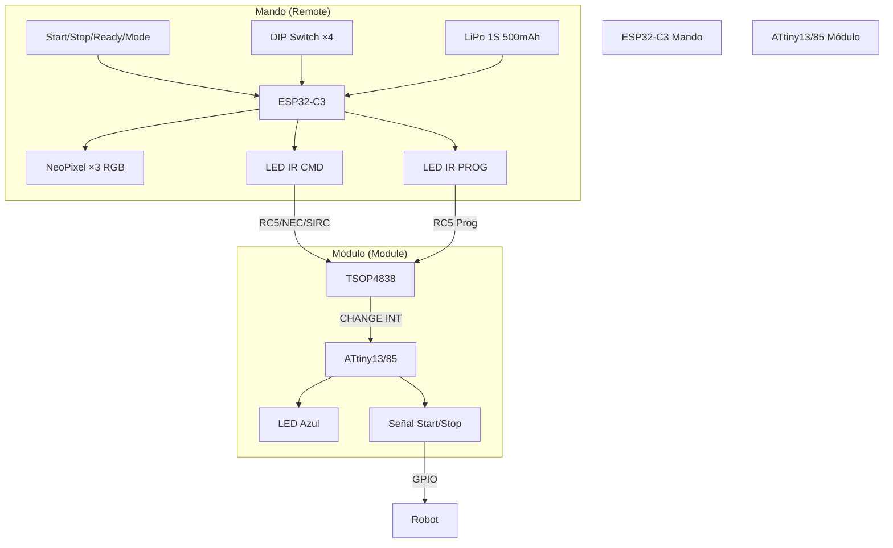

# Hardware

El sistema IRStart se compone de dos dispositivos independientes: un **mando**
(Remote) basado en ESP32-C3 que emite señales infrarrojas con múltiples
protocolos, y un **módulo** (Module) basado en ATtiny que las recibe y actúa
como señal de arranque/parada para robots de competición.

---

## Mando (Remote)

### Microcontrolador

| Característica | Detalle |
|---------------|---------|
| **Modelo** | Seeed XIAO ESP32C3 |
| **MCU** | ESP32-C3 (RISC-V 32 bits) |
| **Frecuencia** | 160 MHz |
| **Flash** | 4 MB |
| **RAM** | 400 KB SRAM |
| **Framework** | Arduino (ESP32 Core) |
| **Entorno** | PlatformIO |

### Componentes

| Componente | Modelo / Especificación | Cantidad |
|-----------|------------------------|----------|
| **LED IR (alta intensidad)** | MOSFET para Start/Stop | 2 |
| **LED IR (baja intensidad)** | MOSFET para Ready | 1 |
| **LED RGB** | NeoPixel WS2812B (×3) | 1 tira |
| **LED indicador** | LED onboard | 1 |
| **Botón Start** | Pulsador táctil | 1 |
| **Botón Stop** | Pulsador táctil | 1 |
| **Botón Ready** | Pulsador táctil | 1 |
| **Botón Modo** | Pulsador táctil | 1 |
| **DIP Switch** | 4 posiciones | 1 |
| **Interruptor** | Encendido principal | 1 |
| **Cargador de batería** | Módulo carga LiPo 1S | 1 |
| **Batería** | LiPo 1S 500 mAh | 1 |

### Pinout

| Pin | Periférico | Función |
|-----|-----------|---------|
| **GPIO 8** | LED | LED indicador onboard |
| **GPIO 5** | NeoPixel | Tira de 3 LEDs RGB |
| **GPIO 2** | BAT_ANALOG | Lectura de batería (definido, sin usar) |
| **GPIO 4** | IR_CMD / LEDC Ch.0 | LED IR de comandos (Start/Stop) |
| **GPIO 7** | IR_PROG / LEDC Ch.1 | LED IR de programación (Ready) |
| **GPIO 21** | BTN_START | Botón de inicio |
| **GPIO 20** | BTN_STOP | Botón de parada |
| **GPIO 10** | BTN_READY | Botón de preparado |
| **GPIO 6** | BTN_MODE | Botón de cambio de modo |
| **GPIO 0** | DIP_SW_0 | DIP switch bit 0 (LSB) |
| **GPIO 1** | DIP_SW_1 | DIP switch bit 1 |
| **GPIO 2** | DIP_SW_2 | DIP switch bit 2 |
| **GPIO 3** | DIP_SW_3 | DIP switch bit 3 (MSB) |

> **Nota**: Los pines de los DIP switches usan GPIO 0–3. GPIO 2 está compartido
> con `BAT_ANALOG`, pero la funcionalidad de lectura de batería no está
> implementada.

### LEDs IR y MOSFETs

El mando utiliza dos canales PWM independientes para los LEDs infrarrojos:

| Canal | GPIO | LEDC Ch. | Propósito | Intensidad |
|-------|------|----------|-----------|------------|
| **CMD** | GPIO 4 | 0 | Start / Stop | Alta (MOSFET dedicado) |
| **PROG** | GPIO 7 | 1 | Ready / Programación | Baja (MOSFET dedicado) |

Cada canal se configura con PWM de 10 bits de resolución. La frecuencia
portadora varía según el protocolo: **36 kHz** para RC5 y **37–40 kHz** para
NEC y SIRC.

---

## Módulo (Module)

### Microcontrolador

| Característica | Detalle |
|---------------|---------|
| **Modelo** | ATtiny13 / ATtiny85 |
| **Arquitectura** | AVR 8 bits |
| **Frecuencia** | 1.2 MHz (default) / 9.6 MHz (internal) |
| **Flash** | 1 KB (ATtiny13) / 8 KB (ATtiny85) |
| **RAM** | 64 B (ATtiny13) / 512 B (ATtiny85) |
| **EEPROM** | 64 B (ATtiny13) / 512 B (ATtiny85) |
| **Framework** | Arduino (ATTinyCore) |
| **Entorno** | PlatformIO |

El `platformio.ini` soporta tanto **ATtiny13** como **ATtiny85**, con entornos
de programación directa y vía ArduinoISP.

### Componentes

| Componente | Modelo / Especificación | Cantidad |
|-----------|------------------------|----------|
| **Receptor IR** | TSOP4838 | 1 |
| **LED azul** | SMD 0804 | 1 |
| **Resistencia** | 220 Ω SMD 0804 | 1 |
| **Condensador** | 104 (100 nF) SMD 0402 | 1 |

### Pinout

| Pin | Periférico | Función |
|-----|-----------|---------|
| **PB0** | PIN_SIGNAL | Salida de señal Start/Stop |
| **PB1** | PIN_IR | Receptor IR (TSOP4838) con interrupción CHANGE |
| **PB2** | PIN_RESET | Reset de EEPROM (definido, código comentado) |
| **PB4** | PIN_LED | LED indicador de estado |

> **Nota**: PB2 (Pin 2) está definido como `PIN_RESET` para restaurar la EEPROM
> a valores de fábrica, pero tanto la lectura del pin como la función
> `rc5_reset_eeprom()` están comentadas en el código.

### Diseño mecánico

| Característica | Detalle |
|---------------|---------|
| **PCB** | Diseño personalizado (SMD) |
| **Modelo 3D** | [`3d_model/Module/IRStart - Module.stl`](../3d_model/Module/IRStart%20-%20Module.stl) |
| **STEP** | [`3d_model/Module/IRStart - Module.step`](../3d_model/Module/IRStart%20-%20Module.step) |
| **Carcasa Remote** | [`3d_model/Remote/IRstart - Remote PCB.step`](../3d_model/Remote/IRstart%20-%20Remote%20PCB.step) |

---

## Diagrama del Sistema

---

*Documento generado el 2025-06-25. Ver también [Arquitectura Software](02-software-architecture.md), [Protocolos IR](03-ir-protocols.md).*
