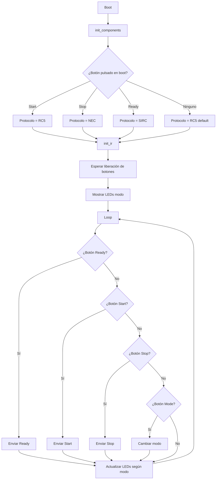
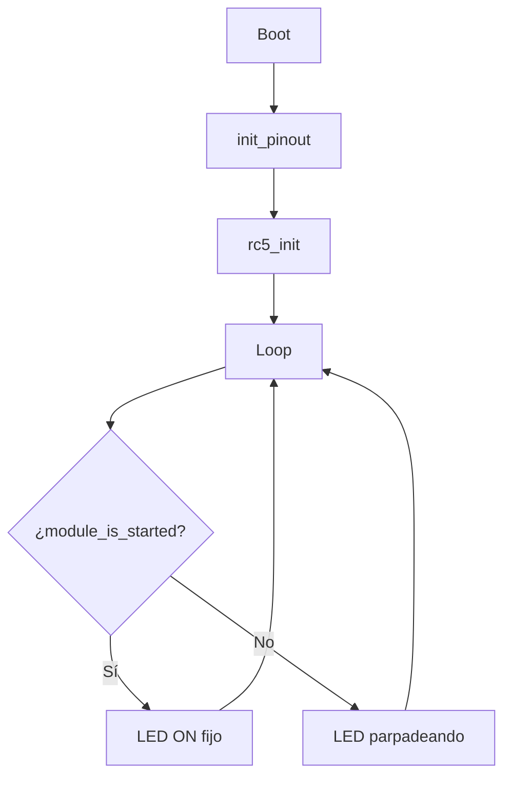
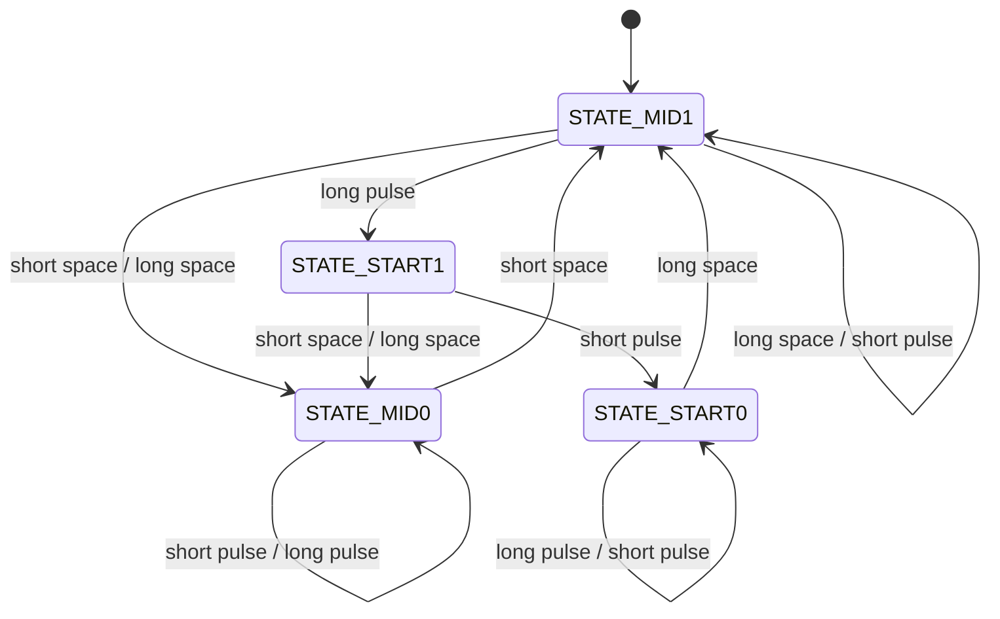

# Arquitectura Software

El sistema IRStart tiene dos arquitecturas independientes: el **mando**
(Remote, ESP32-C3) que emite códigos IR, y el **módulo** (Module,
ATtiny13/85) que los recibe y controla la señal de arranque/parada.

---

## Mando (Remote — ESP32-C3)

### Bucle Principal



### Secuencia de Boot

1. `init_components()` configura todos los pines (GPIO, NeoPixel, Serial)
2. Se detecta qué botón está pulsado al encender para seleccionar el protocolo
3. Se inicializa el protocolo IR con `init_ir()`
4. Se espera a que el usuario suelte todos los botones (LED parpadea)
5. Se muestran los colores de modo en los NeoPixels y se entra al bucle

| Protocolo | Botón en boot | Color Ready | Color Start | Color Stop |
|-----------|---------------|-------------|-------------|------------|
| **RC5** | Start | Rojo | Verde | Azul |
| **NEC** | Stop | Rojo | Verde | Azul |
| **SIRC** | Ready | Rojo | Verde | Azul |

### Sistema de Modos

El mando tiene dos modos de operación:

| Modo | ID | Botón Start | Botón Stop | Botón Ready |
|------|----|------------|------------|------------|
| **IRSTART** | 0 | Envía Start | Envía Stop | Prog/Ready |
| **IRMENU** | 1 | Menú Arriba | Menú Abajo | Menú Modo |

El cambio de modo se realiza con el botón Mode (GPIO 6) y es cíclico:
`(modo_actual + 1) % NUM_MODES`.

### Envío de comandos

Cada protocolo implementa su propia inicialización y funciones de envío:

| Función | RC5 | NEC | SIRC |
|---------|-----|-----|------|
| **Init** | `rc5_init()` | `nec_init()` | `sirc_init()` |
| **Ready** | `rc5_send_prog()` | `nec_send_ready()` | `sirc_send_ready()` |
| **Start** | `rc5_send_start()` | `nec_send_start()` | `sirc_send_start()` |
| **Stop** | `rc5_send_stop()` | `nec_send_stop()` | `sirc_send_stop()` |

### Sistema de entrada

Todos los botones usan un debounce por software de 10 ms con doble lectura:

```cpp
bool get_btn_start() {
    bool state1 = digitalRead(BTN_START);
    delay(10);
    bool state2 = digitalRead(BTN_START);
    return state1 && state2;
}
```

El DIP switch de 4 posiciones se lee como un valor de 4 bits, desplazado 1
bit a la izquierda (`<< 1`), generando un ID de robot par entre 0 y 30.

---

## Módulo (Module — ATtiny13/85)

### Bucle Principal



### ISR del Receptor IR

El módulo opera enteramente por interrupciones. El pin `PIN_IR` (PB1) se
configura con `attachInterrupt(CHANGE)` para detectar cada flanco (subida
y bajada) de la señal del TSOP4838.

| Parámetro | Valor |
|-----------|-------|
| **Pin** | PB1 (digitalPinToInterrupt) |
| **Modo** | CHANGE (flanco de subida y bajada) |
| **ISR** | `rc5_isr()` |

### Cadena de procesamiento RC5

```
TSOP4838 → PIN_IR (CHANGE INT) → rc5_isr() → rc5_register() → rc5_decode_pulse()
    → rc5_decode_event() → (14 bits) → rc5_manage_command()
```

1. **`rc5_isr()`**: Lee el estado del pin IR y llama a `rc5_register()` con el
   trigger (RISING/FALLING)
2. **`rc5_register()`**: Calcula el tiempo transcurrido desde el último flanco
   y llama a `rc5_decode_pulse()` con ese `elapsed`. Incluye un
   `delayMicroseconds(100)` tras el cálculo
3. **`rc5_decode_pulse()`**: Clasifica el pulso como corto o largo según las
   constantes de timing, y llama a `rc5_decode_event()`
4. **`rc5_decode_event()`**: Máquina de estados de 4 estados para decodificar
   el código Manchester del protocolo RC5
5. **`rc5_manage_command()`**: Cuando se completan 14 bits, procesa el comando:
   - **Address PROG (0x0B)**: Programa un nuevo código de start/stop
   - **Address COMP (0x07)**: Compara con el código almacenado y ejecuta
   - **Default**: Comandos fijos 0x01 (start) y 0x02 (stop)

### Máquina de Estados RC5 (Receptor)



> Basado en la implementación de [clearwater.com.au/code/rc5](https://clearwater.com.au/code/rc5).

### Control de señal

| Función | Efecto |
|---------|--------|
| `module_start()` | `PIN_SIGNAL = HIGH`, `PIN_LED = HIGH`, `started = true` |
| `module_stop()` | `PIN_SIGNAL = LOW`, `PIN_LED = LOW`, `started = false` |
| `module_feedback()` | 5 parpadeos LED acelerados + pausa de 1.5 s |

El pin `PIN_SIGNAL` (PB0) es la salida física hacia el robot, y el LED (PB4)
refleja el estado de la señal.

---

## Compilación condicional

| Macro | Función |
|-------|---------|
| `PIO_FRAMEWORK_ARDUINO_ENABLE_CDC` | Habilita CDC Serial en ESP32-C3 (Remote) |

---

*Documento generado el 2025-06-25. Ver también [Hardware](01-hardware.md), [Protocolos IR](03-ir-protocols.md), [Problemas Conocidos](07-known-issues.md).*
