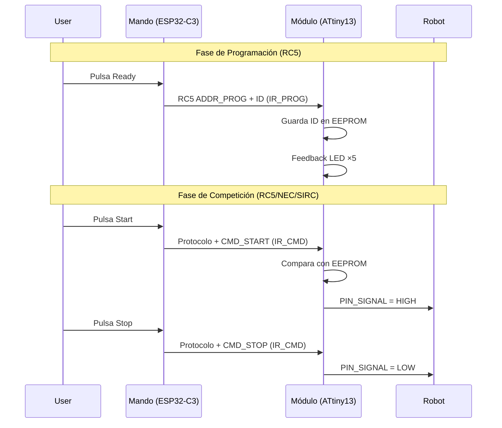

# Protocolos IR

El mando implementa tres protocolos infrarrojos que se seleccionan durante el
arranque. Cada protocolo tiene su propia codificación, temporización y
frecuencia portadora. El módulo receptor solo decodifica **RC5**.

---

## Comparativa de Protocolos

| Característica | RC5 | NEC | SIRC |
|---------------|-----|-----|------|
| **Frecuencia portadora** | 36 kHz | 37 kHz | 37 kHz |
| **Codificación** | Manchester (bi-fase) | Pulso-espacio | Pulso-espacio |
| **Bits de comando** | 6 | 8 | 7 |
| **Bits de dirección** | 5 | 8 | 5 |
| **Bit de toggle** | Sí (1 bit) | No | No |
| **Repetición** | Reenvío completo | Código de repetición especial | Reenvío completo |
| **Fin de trama** | Liberación de portadora | Pulso final 560 µs | Liberación de portadora |
| **Tiempo entre comandos** | — | 110 ms | 45 ms |
| **Usado por módulo** | ✅ Sí | ❌ No | ❌ No |

---

## RC5 (Remote Control 5)

Protocolo principal del sistema, desarrollado originalmente por Philips.
El mando lo usa en **modo IRSTART e IRMENU**.

### Formato de trama

```
| S1 | S2 | T | A4 | A3 | A2 | A1 | A0 | C5 | C4 | C3 | C2 | C1 | C0 |
|   Start  | Toggle |    Dirección (5 bits)    |     Comando (6 bits)       |
```

| Campo | Bits | Posición | Descripción |
|-------|------|----------|-------------|
| **Start** | 2 | 13–12 | Bits de inicio (S1=1, S2=1) |
| **Toggle** | 1 | 11 | Bit de alternancia (cambia cada pulsación) |
| **Address** | 5 | 10–6 | Dirección del dispositivo |
| **Command** | 6 | 5–0 | Código del comando |

### Codificación Manchester

En RC5 cada bit se codifica en dos medios bits:
- **Bit 1**: portadora OFF → portadora ON (flanco de bajada en el medio)
- **Bit 0**: portadora ON → portadora OFF (flanco de subida en el medio)

Cada medio bit tiene una duración nominal de **889 µs** (1/36 kHz × 32 ciclos).

### Temporización del Receptor

El receptor usa la siguientes ventanas de detección (en µs):

| Pulso | Mínimo | Máximo |
|-------|--------|--------|
| **Corto** | 444 µs | 1333 µs |
| **Largo** | 1334 µs | 2222 µs |

> **⚠️ Advertencia**: El gap entre corto y largo es de solo 1 µs
> (MAX_SHORT = 1333, MIN_LONG = 1334). Esto no deja histéresis y puede
> causar detecciones erróneas con tolerancia de reloj. Ver
> [SW-04](07-known-issues.md#sw-04).

### Direcciones y Comandos

| Dirección | Uso | Comandos |
|-----------|-----|----------|
| **0x07** (COMP) | Competición — Start/Stop | `0x01` = Stop, `0x02` = Start + ID robot |
| **0x0B** (PROG) | Programación — Configurar ID | `0x01` + ID = Programar |
| **0x1B** (IRMENU) | Control de menú remoto | `0x0C` = Mode, `0x0D` = Up, `0x0E` = Down |

### ID de Robot

El DIP switch de 4 bits genera un ID entre 0 y 30 (par, `dip << 1`).
Cuando el ID es 0, se usan comandos fijos; cuando es distinto de 0, se
codifica en los bits superiores del comando:

- **Start con ID ≠ 0**: `(id << 1) | 0b00000001` → bit bajo = 1
- **Stop con ID ≠ 0**: `(id << 1) & 0b11111110` → bit bajo = 0

### Implementación en el Mando

[`rc5.cpp:1-139`](../source_code/Remote/src/rc5.cpp)

| Función | Dirección | Comando | Canal PWM |
|---------|-----------|---------|-----------|
| `rc5_send_prog()` | 0x0B | 0x01 (id=0) / `id<<1` | IR_PROG (Ch.1) |
| `rc5_send_start()` | 0x07 | 0x02 (id=0) / `(id<<1)\|1` | IR_CMD (Ch.0) |
| `rc5_send_stop()` | 0x07 | 0x01 (id=0) / `(id<<1)&0xFE` | IR_CMD (Ch.0) |
| `rc5_send_menu_mode()` | 0x1B | 0x0C | IR_CMD (Ch.0) |
| `rc5_send_menu_up()` | 0x1B | 0x0D | IR_CMD (Ch.0) |
| `rc5_send_menu_down()` | 0x1B | 0x0E | IR_CMD (Ch.0) |

| Parámetro | Valor |
|-----------|-------|
| **PWM freq** | 36 kHz |
| **Resolución PWM** | 10 bits (0–1023) |
| **Duty cycle** | 1/5 (≈205) |
| **Duración medio bit** | 889 µs |

### Implementación en el Módulo

[`rc5.cpp:1-121`](../source_code/Module/src/rc5.cpp)

| Constante | Valor |
|-----------|-------|
| `MIN_SHORT` | 444 µs |
| `MAX_SHORT` | 1333 µs |
| `MIN_LONG` | 1334 µs |
| `MAX_LONG` | 2222 µs |

---

## NEC

Protocolo desarrollado por NEC Corporation, usado en muchos mandos de consumo.

### Formato de trama

```
| Start Burst | Address | ~Address | Command | ~Command | Stop Bit |
|   9 ms ON   |  8 bits |  8 bits  |  8 bits |  8 bits  | 560 µs   |
|  4.5 ms OFF |         | (invert) |         | (invert) |          |
```

| Campo | Descripción |
|-------|-------------|
| **Start Burst** | 9 ms portadora ON + 4.5 ms OFF |
| **Address** | Dirección de 8 bits (0x01 fijo) |
| **~Address** | Dirección invertida (verificación) |
| **Command** | Comando de 8 bits |
| **~Command** | Comando invertido (verificación) |
| **Stop Bit** | Pulso final de 560 µs |

### Codificación de bits

| Bit | Portadora ON | Espacio |
|-----|-------------|---------|
| **0** | 560 µs | 560 µs |
| **1** | 560 µs | 1690 µs |

### Código de Repetición

Para repeticiones (botón mantenido pulsado), se envía un código especial:
- 9 ms portadora ON + 2.25 ms OFF + 560 µs ON

### Implementación

[`nec.cpp:1-134`](../source_code/Remote/src/nec.cpp)

| Parámetro | Valor |
|-----------|-------|
| **PWM freq** | 37 kHz |
| **Duty cycle** | 1/3 (≈341) |
| **Tiempo entre comandos** | 110 ms |
| **Address** | 0x01 |
| **CMD_READY** | 0x00 |
| **CMD_START** | 0x01 |
| **CMD_STOP** | 0x02 |

---

## SIRC (Sony Infrared Remote Control)

Protocolo de Sony, usado en productos de consumo (TV, audio).

### Formato de trama

```
| Start Burst | Command (7 bits) | Address (5 bits) |
|  2.4 ms ON  |  LSB primero     |  LSB primero     |
|  0.6 ms OFF |                   |                  |
```

| Campo | Descripción |
|-------|-------------|
| **Start Burst** | 2.4 ms portadora ON + 0.6 ms OFF |
| **Command** | 7 bits, LSB primero |
| **Address** | 5 bits, LSB primero |

### Codificación de bits

| Bit | Portadora ON | Espacio |
|-----|-------------|---------|
| **0** | 600 µs | 600 µs |
| **1** | 1200 µs | 600 µs |

> **Nota**: En SIRC, los bits se envían en orden **LSB primero** (a diferencia
> de NEC y RC5 que usan MSB primero). Ver el bucle `for (int i = 0; i < 7; i++)`
> en la implementación.

### Implementación

[`sirc.cpp:1-95`](../source_code/Remote/src/sirc.cpp)

| Parámetro | Valor |
|-----------|-------|
| **PWM freq** | 37 kHz |
| **Duty cycle** | 1/3 (≈341) |
| **Tiempo entre comandos** | 45 ms |
| **Address** | 0x01 |
| **CMD_READY** | 0x00 |
| **CMD_START** | 0x01 |
| **CMD_STOP** | 0x02 |

---

## Flujo de Comunicación



---

*Documento generado el 2025-06-25. Ver también [Arquitectura Software](02-software-architecture.md), [Hardware](01-hardware.md), [Problemas Conocidos](07-known-issues.md).*
