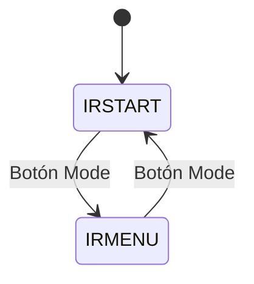
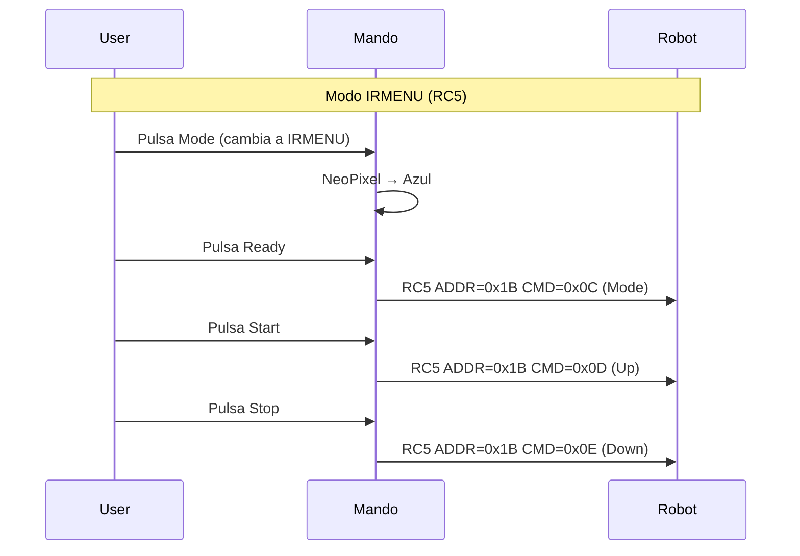

# Sistema de Menú

El mando incorpora un sistema de menú IR para control remoto de robots
compatibles (modo **IRMENU**). Este modo es adicional al modo principal de
arranque (IRSTART) y permite navegar por menús de configuración del robot
mediante infrarrojos.

---

## Modos de Operación

El sistema tiene dos modos, ciclables con el botón Mode:



| Modo | ID | Función |
|------|----|---------|
| **IRSTART** | 0 | Arranque/parada de competición |
| **IRMENU** | 1 | Navegación por menús del robot |

## Indicación Visual

Los NeoPixels indican el modo activo:

| Modo | NeoPixel 0 (Ready) | NeoPixel 1 (Start) | NeoPixel 2 (Stop) |
|------|--------------------|--------------------|--------------------|
| **IRSTART** | Verde (G=50) | Rojo (R=50) | Magenta (R=50, B=50) |
| **IRMENU** | Apagado | Apagado | Azul (B=50) |

## Mapeo de Botones

En modo IRMENU, los botones cambian de función respecto al modo IRSTART:

| Botón | Modo IRSTART | Modo IRMENU |
|-------|-------------|-------------|
| **Ready** | Programar ID | Menú Modo |
| **Start** | Iniciar | Menú Arriba |
| **Stop** | Parar | Menú Abajo |

## Protocolo

El modo IRMENU **solo funciona con el protocolo RC5**. Si se seleccionó NEC
o SIRC al arrancar, el mando no enviará comandos de menú (en su lugar,
`error_led()`).

| Comando | Dirección RC5 | Comando RC5 | Función |
|---------|--------------|-------------|---------|
| Menú Modo | `0x1B` (27) | `0x0C` (12) | Cambiar modo/seleccionar |
| Menú Arriba | `0x1B` (27) | `0x0D` (13) | Navegar arriba |
| Menú Abajo | `0x1B` (27) | `0x0E` (14) | Navegar abajo |

### Implementación

[`rc5.cpp:120-139`](../source_code/Remote/src/rc5.cpp)

```cpp
void rc5_send_menu_mode() {
    set_led(true);
    send_packet(IR_CMD_PWM, ADDR_IRMENU, CMD_IRMENU_MODE);
    set_led(false);
    delay(30);
}
```

---

## Flujo de Navegación



---

*Documento generado el 2025-06-25. Ver también [Protocolos IR](03-ir-protocols.md), [Arquitectura Software](02-software-architecture.md).*
