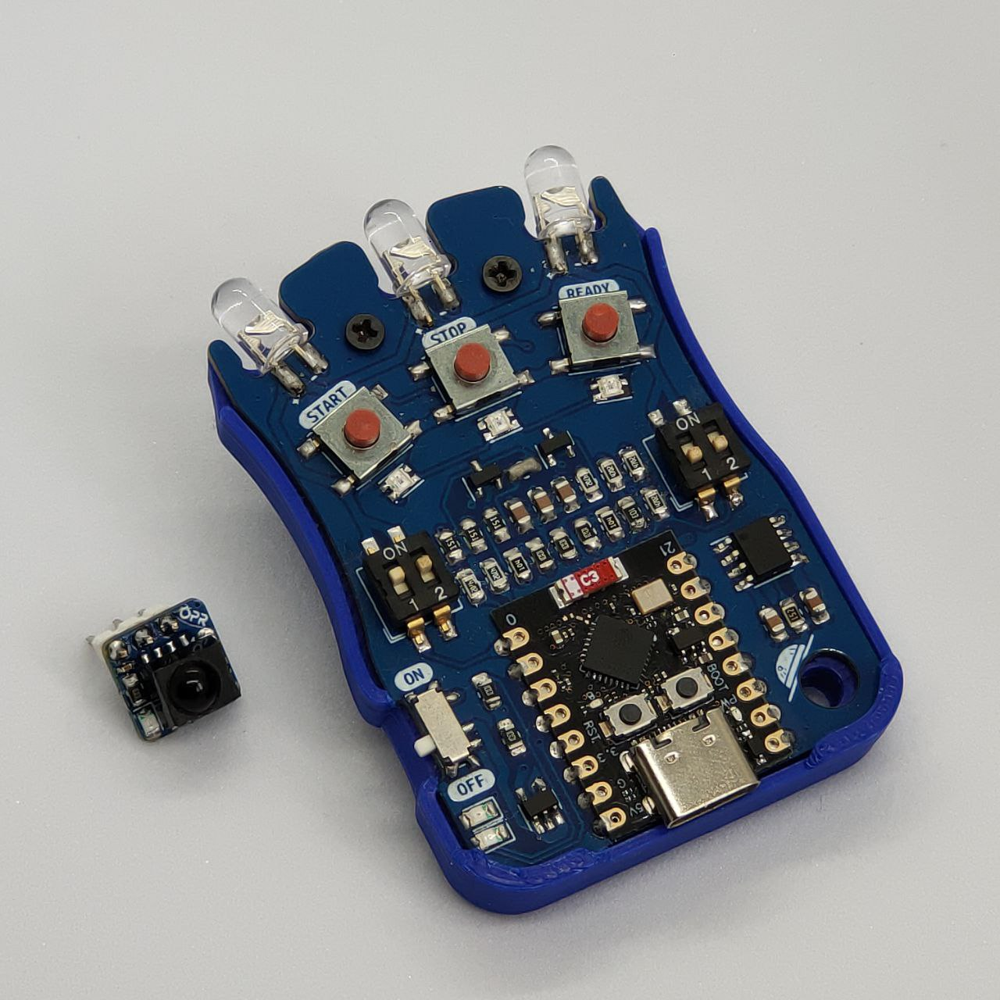

# IRStart

Sistema de arranque por infrarrojos para competiciones de robótica. Compuesto
por un **mando** inalámbrico multi-protocolo (RC5, NEC, SIRC) y un **módulo**
receptor ultracompacto compatible con el estándar de la RoboChallenge Romania.

---

## ⚙️ Hardware

| Característica | Detalle |
|---------------|---------|
| **Mando MCU** | ESP32-C3 (Seeed XIAO) @ 160 MHz |
| **Módulo MCU** | ATtiny13 / ATtiny85 @ 1.2 MHz |
| **Emisor IR** | 3× LEDs IR con MOSFETs |
| **Receptor IR** | TSOP4838 |
| **Batería** | LiPo 1S 500 mAh con cargador integrado |
| **Indicadores** | NeoPixel RGB ×3 + LED onboard |

## 💻 Software

| Componente | Detalle |
|-----------|---------|
| **Framework** | Arduino |
| **Entorno** | PlatformIO |
| **Protocolos IR** | RC5, NEC, SIRC |
| **Modos** | IRSTART (competición) + IRMENU (control menú) |
| **Debug** | Serial 115200 baud + patrones LED |

## 📚 Documentación

- [Hardware](01-hardware.md) — MCUs, pinout, componentes, diseño mecánico
- [Arquitectura Software](02-software-architecture.md) — Bucles principales, ISRs, máquinas de estado
- [Protocolos IR](03-ir-protocols.md) — RC5, NEC, SIRC: codificación, temporización, implementación
- [Sistema de Menú](04-menu-system.md) — Modo IRMENU, navegación remota
- [Sistema de Debug](05-debug-system.md) — Salida serie, patrones LED, telemetría
- [EEPROM](06-storage.md) — EEPROM del ATtiny, comandos programados
- [Problemas Conocidos](07-known-issues.md) — 10 issues documentados (3 críticos)

---

## 🔧 Stack Tecnológico

| Capa | Tecnología |
|------|-----------|
| **Mando MCU** | ESP32-C3 (RISC-V) |
| **Módulo MCU** | ATtiny13/85 (AVR 8-bit) |
| **Framework** | Arduino |
| **Entorno** | PlatformIO |
| **Lenguaje** | C++11 |
| **Protocolos** | RC5, NEC, SIRC |
| **Documentación** | MkDocs Material |

---

## 🎥 Vídeos

*No disponibles.*

---

*Documento generado el 2025-06-25. Ver también [Hardware](01-hardware.md).*
